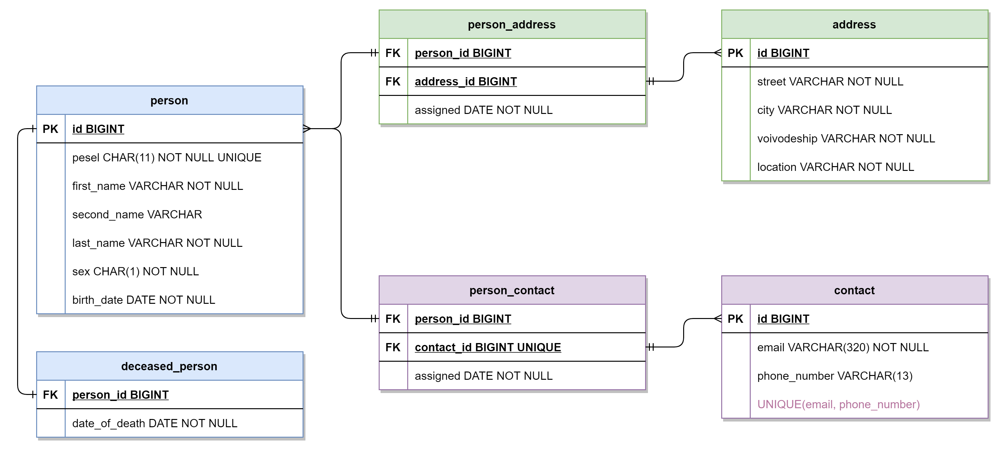

# fakers

<p align="center">
  
</p>


# About
Polish fake persona database system. It produces people according to the following database diagram:

<p align="center">
  
</p>

It generates convincing email addresses based on given person's data, a valid PESEL number and real-world addresses with usable coordinates.

To deploy the system you need:
* `PostgreSQL`, 
* `.NET Core` (at least 3.1),
* `Erlang/OTP`,
* `Elixir`.

## Database

The database definition contains a separate postgres user, tables, indexes and triggers. Ubuntu deployment is automated and provided [here](database/README.md). 
On Windows similar procedures apply. After installing Postgres (remember the master password) launch an administrator PowerShell and:

```sh
psql -f "./init.sql"
psql -U fakers_u -d fakers_db -f "./tables.sql"
psql -U fakers_u -d fakers_db -f "./triggers.sql"
```

That should prepare what's needed to start the generator.

## Generator

Written in C# - `.NET Core 3.1`. Generates person data and persists it in the database. The generator application depends on two external APIs:
* `https://api.namefake.com/polish-poland/` - provides Polish names used as seed for the generator,
* `https://api.geoapify.com/v1` - provides geolocation data for real coordinates.

To start generating people data make sure to have a local Postgres database defined as in Database section and run:

```sh
cd generator
dotnet run --project EntityGenerator
```

It will loop forever until an interrupt is sent. At this point you can start the server to make it internet-available.

#### Geoapify note

As of now, a key is provided within the app. It allows for up to 100K requests/month and is a standard free tier service. 

When deploying it in your own environment please obtain your own key and modify `generator/ExternalAPI/GetDataFromJson.cs`'s `_geoKEY` accordingly.

__**This will likely change after presentation (23.12.2020) and a separate key will be required.**__

---

## ORM Server

Written in Elixir. Provides all CRUD operations on the database via GraphQL. 

To get it up and running:
```sh
cd server
mix deps.get
mix phx.server
```

These commands will start the server at your local port `4000`.

## Client

Written in `React.js`. It provides info on the project and uses a GraphiQL component to provide a visual way to present and modify data. The client application is hosted [here](https://bart-kosmala.github.io/fakers/). To deploy your own you need `node.js` and `npm`. 

Simply `npm start` in the `client` directory.

You can feed the client a GraphQL API initially with url parameter - for example: 

[`bart-kosmala.github.io/fakers?api=https://swapi-graphql.netlify.app/.netlify/functions/index`](https://bart-kosmala.github.io/fakers?api=https://swapi-graphql.netlify.app/.netlify/functions/index)

To integrate the client with deployed application simply pass the server's address. At this point it should be:

[`bart-kosmala.github.io/fakers?api=http://localhost:4000`](https://bart-kosmala.github.io/fakers?api=http://localhost:4000)

## Hosting

The application was deployed for presentation purposes on `AWS` free tier services. Feel free to invest in some long-term hosting to provide constant access.

# Authors
- Bartosz Kosmala
- Roch Goszczyński
- Jordan Kondracki
- Mateusz Kuźniak
- Hubert Knioła

> 2020 SEM 5 @ PUT
